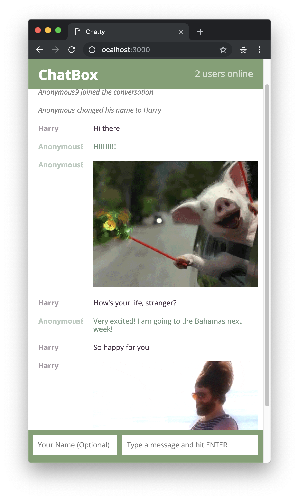
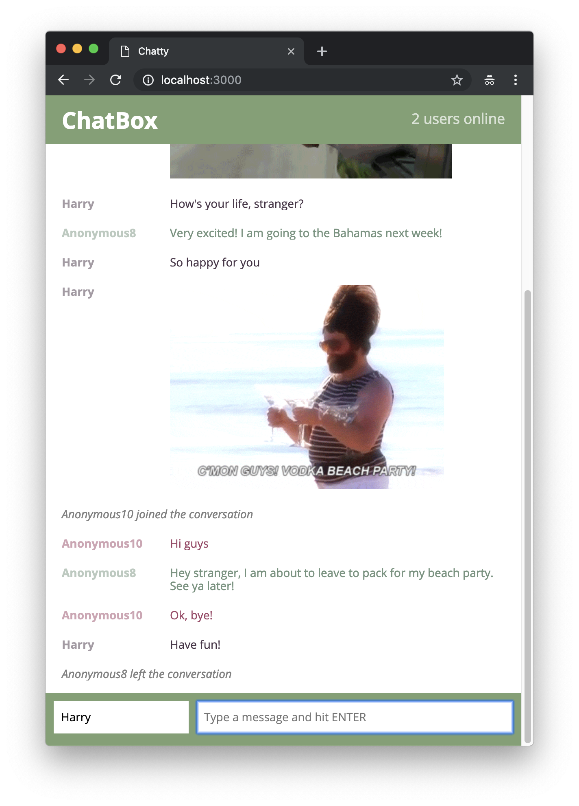
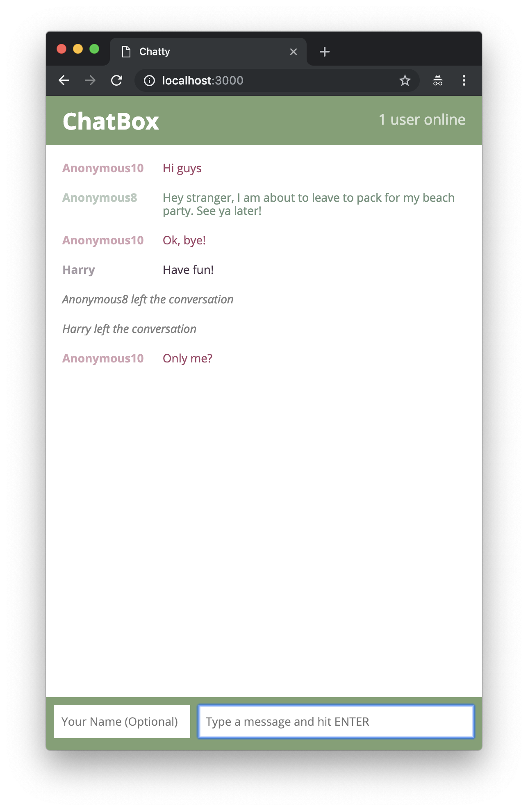

# ChatBox

ChatBox is a single page application that allows users to communicate with each other without having to register accounts. Users can also send giphys with Domain Specific Command `\giphy` or `\gif`. For example, `\gif pokemon` or `\giphy puppies`

You need an api key in the secret file. 

## Final product
- chatting with anonymouse user with giphy


- updates the number of online users and notifies everyone when other user logs in or logs out


- only one user left



## Getting Started
1. Clone this repository 
2. Install dependencies `npm i`
3. Create a `secrets.js` in the root with the giphy api key: 
```javascript
// secrets.js

module.exports = {
  GIPHY_API_KEY: [YOUR_OWN_GIPHY_API_KEY]
}

```

Generate your own giphy api key from: https://developers.giphy.com/

4. Run the server `npm start`
5. Visit `http:localhost:3000`


### Dependencies


* React
* React Dom
* Webpack
* [babel-loader](https://github.com/babel/babel-loader)
* [webpack-dev-server](https://github.com/webpack/webpack-dev-server)
* Axios
* Express
* uuid
* ws
